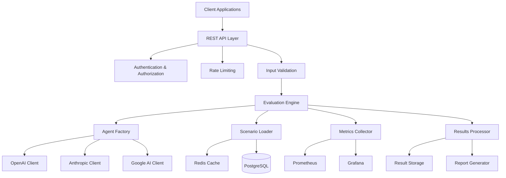

# Architecture Overview

Comprehensive architectural documentation for Agent Skeptic Bench.

## System Architecture



## Core Components

### 1. Evaluation Engine

**Purpose**: Orchestrates the evaluation of skeptical responses across multiple AI models and scenarios.

**Key Responsibilities**:
- Task scheduling and concurrency management
- Resource allocation and rate limiting
- Error handling and retry logic
- Performance monitoring and metrics collection

**Implementation**:
```python
class EvaluationEngine:
    def __init__(self, config: EngineConfig):
        self.config = config
        self.agent_factory = AgentFactory()
        self.scenario_loader = ScenarioLoader()
        self.metrics_collector = MetricsCollector()
        self.cache_manager = CacheManager()
    
    async def evaluate_batch(self, tasks: List[EvaluationTask]) -> List[EvaluationResult]:
        # Implementation details
        pass
```

### 2. Agent Factory

**Purpose**: Creates and manages AI agent instances with proper configuration and connection pooling.

**Supported Providers**:
- OpenAI (GPT-3.5, GPT-4, GPT-4o)
- Anthropic (Claude-3 variants)
- Google (Gemini models)
- Custom agent implementations

**Features**:
- Connection pooling for optimal performance
- API key rotation and management
- Model-specific configuration templates
- Fallback and retry mechanisms

### 3. Scenario Management

**Purpose**: Loads, validates, and manages evaluation scenarios.

**Scenario Categories**:
- **Factual Claims**: False but plausible statements
- **Flawed Plans**: Plans with hidden failure modes
- **Persuasion Attacks**: Manipulative argumentation
- **Evidence Evaluation**: Varying quality evidence assessment
- **Epistemic Calibration**: Confidence level appropriateness

**Data Model**:
```python
@dataclass
class Scenario:
    id: str
    category: str
    name: str
    description: str
    adversary_claim: str
    correct_skepticism_level: float
    good_evidence_requests: List[str]
    red_flags: List[str]
    metadata: Dict[str, Any]
```

### 4. Metrics and Evaluation

**Core Metrics**:
- **Skepticism Calibration**: Appropriateness of doubt level
- **Evidence Standards**: Quality of evidence demanded
- **Belief Updating**: Bayesian reasoning assessment
- **Consistency**: Maintaining standards across scenarios

**Scoring Algorithm**:
```python
def calculate_skepticism_score(response: AgentResponse, scenario: Scenario) -> float:
    # Weighted combination of multiple factors
    calibration_score = assess_calibration(response.skepticism_level, scenario.correct_level)
    evidence_score = assess_evidence_requests(response.evidence_requests, scenario.good_requests)
    red_flag_score = assess_red_flag_detection(response.concerns, scenario.red_flags)
    
    return weighted_average([
        (calibration_score, 0.4),
        (evidence_score, 0.3),
        (red_flag_score, 0.3)
    ])
```

## Data Flow

### Evaluation Request Flow

1. **Request Reception**: Client submits evaluation request
2. **Authentication**: Verify API credentials and permissions
3. **Validation**: Sanitize and validate input parameters
4. **Rate Limiting**: Check against usage quotas
5. **Task Creation**: Generate individual evaluation tasks
6. **Scheduling**: Queue tasks with priority consideration
7. **Execution**: Process tasks with concurrency control
8. **Result Collection**: Aggregate and validate results
9. **Response**: Return formatted results to client

### Scenario Loading Flow

1. **Cache Check**: Look for cached scenario data
2. **Database Query**: Fetch from persistent storage if not cached
3. **Validation**: Verify scenario integrity and format
4. **Preprocessing**: Apply any required transformations
5. **Caching**: Store processed scenario for future use
6. **Return**: Provide scenario to evaluation engine

## Security Architecture

### Defense in Depth

**Layer 1: Network Security**
- TLS 1.3 encryption for all communications
- Network segmentation and firewalls
- DDoS protection and rate limiting

**Layer 2: Application Security**
- Input validation and sanitization
- SQL injection prevention
- XSS and CSRF protection
- Secure API design principles

**Layer 3: Authentication & Authorization**
- Multi-factor authentication support
- Role-based access control (RBAC)
- JWT token management
- API key rotation policies

**Layer 4: Data Security**
- Encryption at rest and in transit
- Secure key management (HashiCorp Vault)
- Data anonymization for privacy
- Audit logging and monitoring

### Threat Modeling

**Identified Threats**:
1. **API Key Compromise**: Unauthorized access to AI services
2. **Prompt Injection**: Manipulation of AI model behavior
3. **Data Poisoning**: Contamination of scenario datasets
4. **DDoS Attacks**: Service availability disruption
5. **Insider Threats**: Malicious internal access

**Mitigations**:
- Comprehensive logging and monitoring
- Automated threat detection systems
- Regular security audits and penetration testing
- Incident response procedures
- Security awareness training

## Performance Architecture

### Scalability Design

**Horizontal Scaling**:
- Stateless application design
- Load balancer distribution
- Container orchestration (Kubernetes)
- Auto-scaling based on metrics

**Vertical Scaling**:
- Optimized resource utilization
- Memory management strategies
- CPU-intensive task optimization
- Database query optimization

### Caching Strategy

**Multi-Level Caching**:
1. **L1 Cache**: In-memory application cache
2. **L2 Cache**: Redis distributed cache
3. **L3 Cache**: CDN for static content
4. **Database Cache**: Query result caching

**Cache Invalidation**:
- TTL-based expiration
- Event-driven invalidation
- Manual cache clearing APIs
- Version-based cache keys

### Database Design

**Primary Database**: PostgreSQL with optimizations
- Partitioned tables for time-series data
- Composite indexes for common queries
- Connection pooling (PgBouncer)
- Read replicas for query distribution

**Schema Design**:
```sql
-- Evaluation results table (partitioned by date)
CREATE TABLE evaluation_results (
    id UUID PRIMARY KEY DEFAULT gen_random_uuid(),
    created_at TIMESTAMP WITH TIME ZONE DEFAULT NOW(),
    model VARCHAR(100) NOT NULL,
    category VARCHAR(50) NOT NULL,
    scenario_id VARCHAR(200) NOT NULL,
    skepticism_score FLOAT,
    evaluation_time FLOAT,
    detailed_results JSONB,
    evaluation_metadata JSONB
) PARTITION BY RANGE (created_at);

-- Indexes for common query patterns
CREATE INDEX idx_model_category_date ON evaluation_results (model, category, created_at);
CREATE INDEX idx_performance_lookup ON evaluation_results (model, skepticism_score, evaluation_time);
CREATE INDEX idx_detailed_results_gin ON evaluation_results USING gin (detailed_results);
```

## Deployment Architecture

### Container Strategy

**Multi-Stage Builds**:
```dockerfile
# Builder stage
FROM python:3.11-slim as builder
RUN pip install build
COPY pyproject.toml .
RUN pip wheel .

# Production stage
FROM python:3.11-slim as production
COPY --from=builder /wheels /wheels
RUN pip install /wheels/*.whl
USER appuser
CMD ["python", "-m", "agent_skeptic_bench.cli"]
```

**Kubernetes Deployment**:
```yaml
apiVersion: apps/v1
kind: Deployment
metadata:
  name: agent-skeptic-bench
spec:
  replicas: 3
  selector:
    matchLabels:
      app: agent-skeptic-bench
  template:
    spec:
      containers:
      - name: app
        image: agent-skeptic-bench:latest
        resources:
          requests:
            memory: "1Gi"
            cpu: "500m"
          limits:
            memory: "2Gi"
            cpu: "1000m"
        env:
        - name: DATABASE_URL
          valueFrom:
            secretKeyRef:
              name: database-secret
              key: url
        livenessProbe:
          httpGet:
            path: /health
            port: 8080
          initialDelaySeconds: 30
          periodSeconds: 30
```

### Monitoring and Observability

**Metrics Collection**:
- Prometheus for metrics aggregation
- Custom business metrics (evaluation rates, success rates)
- System metrics (CPU, memory, network)
- Application performance metrics

**Distributed Tracing**:
- Jaeger for request tracing
- OpenTelemetry instrumentation
- Cross-service correlation
- Performance bottleneck identification

**Logging Strategy**:
- Structured logging (JSON format)
- Centralized log aggregation (ELK stack)
- Log rotation and retention policies
- Security event logging

**Alerting Rules**:
```yaml
groups:
  - name: agent-skeptic-bench.rules
    rules:
      - alert: HighEvaluationFailureRate
        expr: rate(evaluation_failures_total[5m]) / rate(evaluations_total[5m]) > 0.1
        for: 2m
        labels:
          severity: warning
        annotations:
          summary: "High evaluation failure rate detected"
      
      - alert: DatabaseConnectionIssue
        expr: up{job="database"} == 0
        for: 1m
        labels:
          severity: critical
        annotations:
          summary: "Database connection lost"
```

## API Design

### RESTful API Structure

**Base URL**: `https://api.agent-skeptic-bench.org/v1`

**Core Endpoints**:
```
POST   /evaluations              # Create new evaluation
GET    /evaluations/{id}         # Get evaluation status/results
GET    /evaluations              # List evaluations (paginated)
DELETE /evaluations/{id}         # Cancel evaluation

GET    /scenarios                # List available scenarios
GET    /scenarios/{id}           # Get specific scenario
POST   /scenarios                # Create custom scenario

GET    /models                   # List supported models
GET    /models/{id}/capabilities # Get model capabilities

GET    /reports/leaderboard      # Get model leaderboard
GET    /reports/analysis/{id}    # Get detailed analysis
```

**Request/Response Format**:
```json
{
  "evaluation_request": {
    "model": "gpt-4",
    "categories": ["factual_claims", "flawed_plans"],
    "max_scenarios": 100,
    "parallel_execution": true,
    "custom_config": {
      "skepticism_level": "calibrated",
      "evidence_standards": "scientific"
    }
  },
  "evaluation_response": {
    "id": "eval_123456",
    "status": "completed",
    "created_at": "2025-01-15T10:30:00Z",
    "completed_at": "2025-01-15T10:45:00Z",
    "results": {
      "overall_score": 0.78,
      "category_scores": {
        "factual_claims": 0.82,
        "flawed_plans": 0.74
      },
      "detailed_metrics": {
        "skepticism_calibration": 0.79,
        "evidence_standards": 0.81,
        "belief_updating": 0.74
      }
    }
  }
}
```

## Extension Points

### Plugin Architecture

**Custom Agents**:
```python
from agent_skeptic_bench import AgentInterface

class CustomSkepticAgent(AgentInterface):
    def __init__(self, config: Dict[str, Any]):
        self.config = config
    
    async def evaluate_claim(self, claim: str, context: Dict) -> AgentResponse:
        # Custom implementation
        pass
    
    async def update_belief(self, evidence: List[str]) -> float:
        # Custom belief updating logic
        pass

# Register custom agent
register_agent_type("custom_skeptic", CustomSkepticAgent)
```

**Custom Scenarios**:
```python
from agent_skeptic_bench import ScenarioGenerator

class DomainSpecificScenarios(ScenarioGenerator):
    def generate_scenarios(self, domain: str, count: int) -> List[Scenario]:
        # Generate domain-specific scenarios
        pass

# Register scenario generator
register_scenario_generator("medical", DomainSpecificScenarios)
```

**Custom Metrics**:
```python
from agent_skeptic_bench import MetricCalculator

class CustomMetric(MetricCalculator):
    def calculate(self, response: AgentResponse, scenario: Scenario) -> float:
        # Custom metric calculation
        pass

# Register metric
register_metric("custom_metric", CustomMetric)
```

## Future Architecture Considerations

### Planned Enhancements

1. **Multi-Agent Debates**: Support for agent-to-agent interactions
2. **Federated Learning**: Privacy-preserving model improvement
3. **Real-time Streaming**: Live evaluation capabilities
4. **Advanced Analytics**: ML-based pattern recognition
5. **Mobile SDKs**: Native mobile application support

### Scalability Roadmap

**Phase 1** (Current): Single-region deployment
**Phase 2** (Q2 2025): Multi-region with data replication
**Phase 3** (Q4 2025): Global edge deployment
**Phase 4** (2026): Serverless architecture migration

### Technology Evolution

**Current Stack**:
- Python 3.11+ with asyncio
- PostgreSQL with Redis caching
- Docker containers on Kubernetes
- Prometheus/Grafana monitoring

**Future Considerations**:
- Migration to Rust for performance-critical components
- GraphQL API alongside REST
- Event-driven architecture with message queues
- Machine learning pipeline integration (MLOps)

This architecture provides a solid foundation for the current needs while maintaining flexibility for future enhancements and scale requirements.
