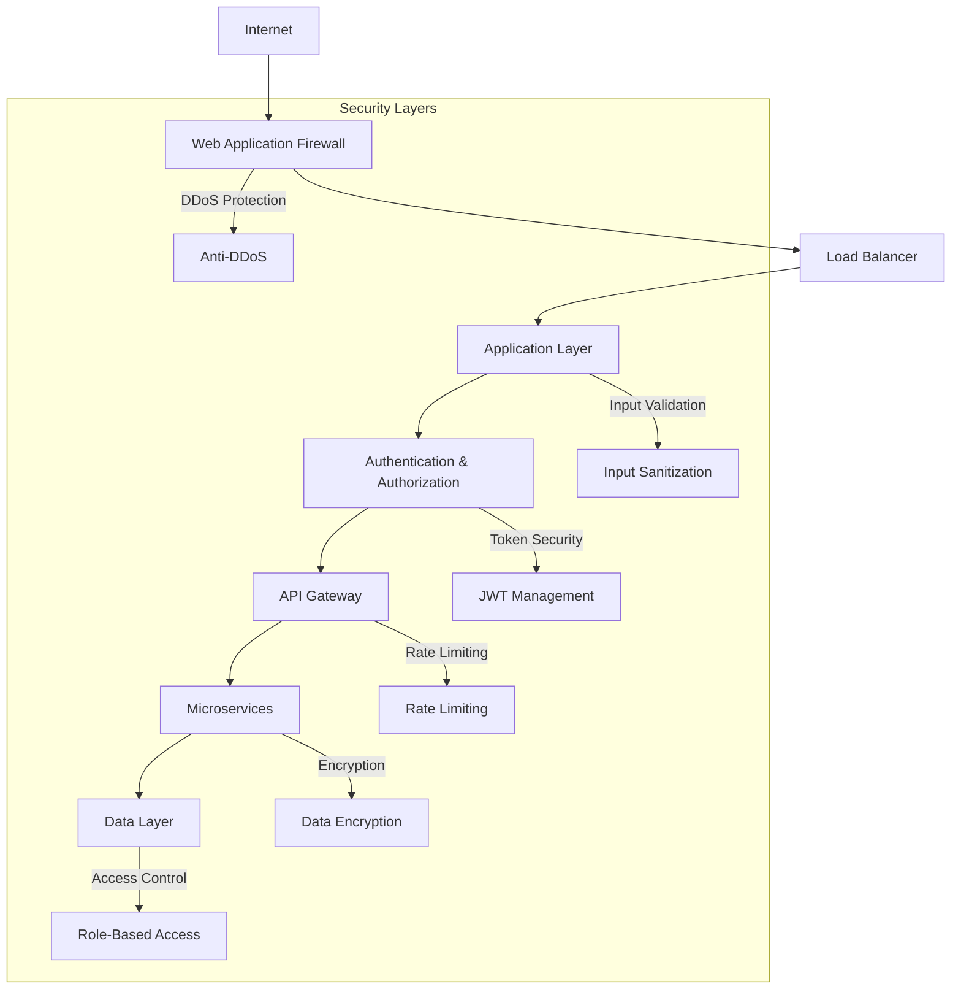

# Security Implementation Guide

## Overview

This document provides comprehensive security implementation guidelines for Agent Skeptic Bench, covering application security, infrastructure security, and operational security practices.

## Security Architecture

### Defense in Depth Strategy



## Application Security

### Authentication and Authorization

#### JWT Token Management

```python
import jwt
from datetime import datetime, timedelta
from typing import Optional, Dict, Any

class JWTManager:
    def __init__(self, secret_key: str, algorithm: str = "HS256"):
        self.secret_key = secret_key
        self.algorithm = algorithm
        self.token_expiry = timedelta(hours=24)
        self.refresh_expiry = timedelta(days=7)
    
    def generate_tokens(self, user_id: str, roles: list) -> Dict[str, str]:
        """Generate access and refresh tokens."""
        now = datetime.utcnow()
        
        access_payload = {
            "user_id": user_id,
            "roles": roles,
            "type": "access",
            "iat": now,
            "exp": now + self.token_expiry,
            "jti": self._generate_jti()
        }
        
        refresh_payload = {
            "user_id": user_id,
            "type": "refresh",
            "iat": now,
            "exp": now + self.refresh_expiry,
            "jti": self._generate_jti()
        }
        
        return {
            "access_token": jwt.encode(access_payload, self.secret_key, self.algorithm),
            "refresh_token": jwt.encode(refresh_payload, self.secret_key, self.algorithm)
        }
    
    def verify_token(self, token: str) -> Optional[Dict[str, Any]]:
        """Verify and decode JWT token."""
        try:
            payload = jwt.decode(token, self.secret_key, algorithms=[self.algorithm])
            return payload
        except jwt.ExpiredSignatureError:
            raise SecurityError("Token has expired")
        except jwt.InvalidTokenError:
            raise SecurityError("Invalid token")
```

#### Role-Based Access Control (RBAC)

```python
from enum import Enum
from functools import wraps
from typing import List, Callable

class Role(Enum):
    ADMIN = "admin"
    EVALUATOR = "evaluator"
    VIEWER = "viewer"
    API_USER = "api_user"

class Permission(Enum):
    READ_EVALUATIONS = "read:evaluations"
    WRITE_EVALUATIONS = "write:evaluations"
    MANAGE_USERS = "manage:users"
    VIEW_METRICS = "view:metrics"
    ADMIN_ACCESS = "admin:access"

ROLE_PERMISSIONS = {
    Role.ADMIN: [
        Permission.READ_EVALUATIONS,
        Permission.WRITE_EVALUATIONS,
        Permission.MANAGE_USERS,
        Permission.VIEW_METRICS,
        Permission.ADMIN_ACCESS
    ],
    Role.EVALUATOR: [
        Permission.READ_EVALUATIONS,
        Permission.WRITE_EVALUATIONS,
        Permission.VIEW_METRICS
    ],
    Role.VIEWER: [
        Permission.READ_EVALUATIONS,
        Permission.VIEW_METRICS
    ],
    Role.API_USER: [
        Permission.READ_EVALUATIONS,
        Permission.WRITE_EVALUATIONS
    ]
}

def require_permission(permission: Permission):
    """Decorator to require specific permission for endpoint access."""
    def decorator(func: Callable) -> Callable:
        @wraps(func)
        async def wrapper(*args, **kwargs):
            # Extract user from request context
            user_roles = get_current_user_roles()
            
            # Check if any user role has required permission
            has_permission = any(
                permission in ROLE_PERMISSIONS.get(role, [])
                for role in user_roles
            )
            
            if not has_permission:
                raise PermissionError(f"Permission {permission.value} required")
            
            return await func(*args, **kwargs)
        return wrapper
    return decorator
```

### Input Validation and Sanitization

#### Request Validation

```python
from pydantic import BaseModel, validator, Field
from typing import Optional, List
import re

class EvaluationRequest(BaseModel):
    model_name: str = Field(..., regex=r'^[a-zA-Z0-9_-]+$', max_length=50)
    scenario_category: str = Field(..., max_length=100)
    custom_prompt: Optional[str] = Field(None, max_length=5000)
    max_tokens: int = Field(default=1000, ge=100, le=4000)
    temperature: float = Field(default=0.7, ge=0.0, le=2.0)
    tags: Optional[List[str]] = Field(default=[], max_items=10)
    
    @validator('custom_prompt')
    def validate_prompt(cls, v):
        if v:
            # Check for potentially malicious content
            dangerous_patterns = [
                r'<script.*?>.*?</script>',
                r'javascript:',
                r'data:text/html',
                r'eval\s*\(',
                r'exec\s*\('
            ]
            
            for pattern in dangerous_patterns:
                if re.search(pattern, v, re.IGNORECASE):
                    raise ValueError("Potentially malicious content detected")
        return v
    
    @validator('tags')
    def validate_tags(cls, v):
        if v:
            for tag in v:
                if not re.match(r'^[a-zA-Z0-9_-]+$', tag):
                    raise ValueError("Invalid tag format")
                if len(tag) > 30:
                    raise ValueError("Tag too long")
        return v

class UserRegistration(BaseModel):
    email: str = Field(..., regex=r'^[a-zA-Z0-9._%+-]+@[a-zA-Z0-9.-]+\.[a-zA-Z]{2,}$')
    password: str = Field(..., min_length=12, max_length=128)
    organization: Optional[str] = Field(None, max_length=100)
    
    @validator('password')
    def validate_password(cls, v):
        # Check password strength
        if not re.search(r'[A-Z]', v):
            raise ValueError("Password must contain uppercase letter")
        if not re.search(r'[a-z]', v):
            raise ValueError("Password must contain lowercase letter")
        if not re.search(r'\d', v):
            raise ValueError("Password must contain digit")
        if not re.search(r'[!@#$%^&*(),.?":{}|<>]', v):
            raise ValueError("Password must contain special character")
        return v
```

#### SQL Injection Prevention

```python
from sqlalchemy import text
from typing import List, Dict, Any

class SecureDatabase:
    def __init__(self, engine):
        self.engine = engine
    
    async def execute_query(self, query: str, params: Dict[str, Any] = None) -> List[Dict]:
        """Execute parameterized query to prevent SQL injection."""
        try:
            # Use parameterized queries only
            stmt = text(query)
            
            async with self.engine.begin() as conn:
                result = await conn.execute(stmt, params or {})
                return [dict(row) for row in result.fetchall()]
        
        except Exception as e:
            logger.error(f"Database query failed: {e}")
            raise DatabaseError("Query execution failed")
    
    async def get_evaluations(self, user_id: str, category: str = None) -> List[Dict]:
        """Secure evaluation retrieval."""
        query = """
            SELECT id, model_name, scenario_category, created_at, status
            FROM evaluations 
            WHERE user_id = :user_id
        """
        params = {"user_id": user_id}
        
        if category:
            query += " AND scenario_category = :category"
            params["category"] = category
        
        query += " ORDER BY created_at DESC LIMIT 100"
        
        return await self.execute_query(query, params)
```

### API Security

#### Rate Limiting

```python
import asyncio
import time
from typing import Dict, Tuple
import redis.asyncio as redis

class RateLimiter:
    def __init__(self, redis_client: redis.Redis):
        self.redis = redis_client
        self.default_limits = {
            "per_minute": 60,
            "per_hour": 1000,
            "per_day": 10000
        }
    
    async def check_rate_limit(self, user_id: str, endpoint: str) -> Tuple[bool, Dict]:
        """Check if request exceeds rate limits."""
        current_time = int(time.time())
        
        # Define time windows
        windows = {
            "minute": (current_time // 60, 60),
            "hour": (current_time // 3600, 3600),
            "day": (current_time // 86400, 86400)
        }
        
        # Check each time window
        for window_name, (window_key, window_duration) in windows.items():
            key = f"rate_limit:{user_id}:{endpoint}:{window_key}"
            
            # Get current count
            current_count = await self.redis.get(key)
            current_count = int(current_count) if current_count else 0
            
            # Check limit
            limit_key = f"per_{window_name}"
            limit = self.default_limits.get(limit_key, float('inf'))
            
            if current_count >= limit:
                return False, {
                    "error": "Rate limit exceeded",
                    "window": window_name,
                    "limit": limit,
                    "current": current_count,
                    "reset_time": (window_key + 1) * window_duration
                }
        
        # Increment counters
        for window_name, (window_key, window_duration) in windows.items():
            key = f"rate_limit:{user_id}:{endpoint}:{window_key}"
            await self.redis.incr(key)
            await self.redis.expire(key, window_duration)
        
        return True, {"status": "ok"}

# Middleware implementation
async def rate_limit_middleware(request, call_next):
    """Rate limiting middleware."""
    rate_limiter = request.app.state.rate_limiter
    user_id = get_user_id_from_request(request)
    endpoint = request.url.path
    
    allowed, info = await rate_limiter.check_rate_limit(user_id, endpoint)
    
    if not allowed:
        return JSONResponse(
            status_code=429,
            content=info,
            headers={"Retry-After": str(info.get("reset_time", 60))}
        )
    
    response = await call_next(request)
    return response
```

#### CORS Configuration

```python
from fastapi.middleware.cors import CORSMiddleware

def configure_cors(app):
    """Configure CORS with security best practices."""
    
    # Production CORS settings
    if os.getenv("NODE_ENV") == "production":
        allowed_origins = [
            "https://agent-skeptic-bench.org",
            "https://www.agent-skeptic-bench.org",
            "https://api.agent-skeptic-bench.org"
        ]
    else:
        # Development settings
        allowed_origins = [
            "http://localhost:3000",
            "http://localhost:8000",
            "http://127.0.0.1:3000"
        ]
    
    app.add_middleware(
        CORSMiddleware,
        allow_origins=allowed_origins,
        allow_credentials=True,
        allow_methods=["GET", "POST", "PUT", "DELETE"],
        allow_headers=[
            "Authorization",
            "Content-Type",
            "X-API-Key",
            "X-Request-ID"
        ],
        expose_headers=["X-RateLimit-Remaining", "X-RateLimit-Reset"],
    )
```

## Infrastructure Security

### Container Security

#### Secure Dockerfile

```dockerfile
# Multi-stage build for security
FROM python:3.11-slim as builder

# Install build dependencies
RUN apt-get update && apt-get install -y \
    build-essential \
    curl \
    && rm -rf /var/lib/apt/lists/*

# Create virtual environment
RUN python -m venv /opt/venv
ENV PATH="/opt/venv/bin:$PATH"

# Install Python dependencies
COPY pyproject.toml .
RUN pip install --no-cache-dir --upgrade pip && \
    pip install --no-cache-dir build && \
    pip install --no-cache-dir .

# Production stage
FROM python:3.11-slim

# Install security updates and runtime dependencies
RUN apt-get update && apt-get install -y \
    ca-certificates \
    curl \
    dumb-init \
    && apt-get upgrade -y \
    && rm -rf /var/lib/apt/lists/* \
    && groupadd -r app && useradd -r -g app app

# Copy virtual environment
COPY --from=builder /opt/venv /opt/venv
ENV PATH="/opt/venv/bin:$PATH"

# Set security-focused environment variables
ENV PYTHONDONTWRITEBYTECODE=1 \
    PYTHONUNBUFFERED=1 \
    PYTHONPATH=/app/src \
    USER=app \
    UID=1000 \
    GID=1000

# Create app directory and set ownership
RUN mkdir -p /app && chown -R app:app /app
WORKDIR /app

# Copy application code
COPY --chown=app:app src/ ./src/
COPY --chown=app:app pyproject.toml ./

# Switch to non-root user
USER app

# Security headers and limits
EXPOSE 8000
VOLUME ["/app/data", "/app/logs"]

# Health check
HEALTHCHECK --interval=30s --timeout=10s --start-period=60s --retries=3 \
    CMD curl -f http://localhost:8000/health || exit 1

# Use dumb-init to handle signals properly
ENTRYPOINT ["dumb-init", "--"]
CMD ["python", "-m", "uvicorn", "agent_skeptic_bench.main:app", "--host", "0.0.0.0", "--port", "8000"]

# Security labels
LABEL security.scan="enabled" \
      security.policy="restricted" \
      maintainer="security@agent-skeptic-bench.org"
```

#### Container Security Scanning

```yaml
# .github/workflows/container-security.yml
name: Container Security Scan

on:
  push:
    branches: [main]
  pull_request:
    branches: [main]

jobs:
  container-security:
    runs-on: ubuntu-latest
    steps:
      - uses: actions/checkout@v4
      
      - name: Build container image
        run: docker build -t test-image .
      
      - name: Run Trivy vulnerability scanner
        uses: aquasecurity/trivy-action@master
        with:
          image-ref: 'test-image'
          format: 'sarif'
          output: 'trivy-results.sarif'
          severity: 'CRITICAL,HIGH'
      
      - name: Upload Trivy scan results to GitHub Security tab
        uses: github/codeql-action/upload-sarif@v2
        if: always()
        with:
          sarif_file: 'trivy-results.sarif'
      
      - name: Run Hadolint Dockerfile linter
        uses: hadolint/hadolint-action@v3.1.0
        with:
          dockerfile: Dockerfile
          failure-threshold: error
      
      - name: Run Docker Bench Security
        run: |
          docker run --rm --net host --pid host --userns host --cap-add audit_control \
            -e DOCKER_CONTENT_TRUST=$DOCKER_CONTENT_TRUST \
            -v /etc:/etc:ro \
            -v /usr/bin/containerd:/usr/bin/containerd:ro \
            -v /usr/bin/runc:/usr/bin/runc:ro \
            -v /usr/lib/systemd:/usr/lib/systemd:ro \
            -v /var/lib:/var/lib:ro \
            -v /var/run/docker.sock:/var/run/docker.sock:ro \
            --label docker_bench_security \
            docker/docker-bench-security
```

### Network Security

#### TLS Configuration

```python
import ssl
from pathlib import Path

def create_ssl_context(cert_file: str, key_file: str) -> ssl.SSLContext:
    """Create secure SSL context."""
    context = ssl.create_default_context(ssl.Purpose.CLIENT_AUTH)
    
    # Load certificate and key
    context.load_cert_chain(cert_file, key_file)
    
    # Security configurations
    context.minimum_version = ssl.TLSVersion.TLSv1_2
    context.set_ciphers('ECDHE+AESGCM:ECDHE+CHACHA20:DHE+AESGCM:DHE+CHACHA20:!aNULL:!MD5:!DSS')
    context.options |= ssl.OP_NO_SSLv2
    context.options |= ssl.OP_NO_SSLv3
    context.options |= ssl.OP_NO_TLSv1
    context.options |= ssl.OP_NO_TLSv1_1
    context.options |= ssl.OP_SINGLE_DH_USE
    context.options |= ssl.OP_SINGLE_ECDH_USE
    
    return context

# NGINX SSL Configuration
NGINX_SSL_CONFIG = """
server {
    listen 443 ssl http2;
    server_name agent-skeptic-bench.org;
    
    # SSL Configuration
    ssl_certificate /etc/ssl/certs/agent-skeptic-bench.crt;
    ssl_certificate_key /etc/ssl/private/agent-skeptic-bench.key;
    
    # SSL Security
    ssl_protocols TLSv1.2 TLSv1.3;
    ssl_ciphers ECDHE-RSA-AES256-GCM-SHA512:DHE-RSA-AES256-GCM-SHA512:ECDHE-RSA-AES256-GCM-SHA384:DHE-RSA-AES256-GCM-SHA384;
    ssl_prefer_server_ciphers off;
    ssl_session_cache shared:SSL:10m;
    ssl_session_timeout 10m;
    
    # HSTS
    add_header Strict-Transport-Security "max-age=63072000; includeSubDomains; preload";
    
    # Security Headers
    add_header X-Frame-Options DENY;
    add_header X-Content-Type-Options nosniff;
    add_header X-XSS-Protection "1; mode=block";
    add_header Referrer-Policy "strict-origin-when-cross-origin";
    add_header Content-Security-Policy "default-src 'self'; script-src 'self' 'unsafe-inline'; style-src 'self' 'unsafe-inline';";
    
    location / {
        proxy_pass http://app:8000;
        proxy_set_header Host $host;
        proxy_set_header X-Real-IP $remote_addr;
        proxy_set_header X-Forwarded-For $proxy_add_x_forwarded_for;
        proxy_set_header X-Forwarded-Proto $scheme;
    }
}
"""
```

## Data Security

### Encryption at Rest

```python
from cryptography.fernet import Fernet
from cryptography.hazmat.primitives import hashes
from cryptography.hazmat.primitives.kdf.pbkdf2 import PBKDF2HMAC
import base64
import os

class DataEncryption:
    def __init__(self, password: bytes):
        """Initialize encryption with password-derived key."""
        salt = os.urandom(16)
        kdf = PBKDF2HMAC(
            algorithm=hashes.SHA256(),
            length=32,
            salt=salt,
            iterations=100000,
        )
        key = base64.urlsafe_b64encode(kdf.derive(password))
        self.cipher = Fernet(key)
        self.salt = salt
    
    def encrypt_data(self, data: str) -> bytes:
        """Encrypt sensitive data."""
        return self.cipher.encrypt(data.encode())
    
    def decrypt_data(self, encrypted_data: bytes) -> str:
        """Decrypt sensitive data."""
        return self.cipher.decrypt(encrypted_data).decode()
    
    def encrypt_file(self, file_path: str) -> str:
        """Encrypt file and return encrypted file path."""
        with open(file_path, 'rb') as file:
            data = file.read()
        
        encrypted_data = self.cipher.encrypt(data)
        encrypted_path = f"{file_path}.encrypted"
        
        with open(encrypted_path, 'wb') as encrypted_file:
            encrypted_file.write(encrypted_data)
        
        # Securely delete original file
        os.remove(file_path)
        return encrypted_path

# Database field encryption
class EncryptedField:
    def __init__(self, encryption_key: str):
        self.cipher = Fernet(encryption_key.encode())
    
    def encrypt(self, value: str) -> str:
        """Encrypt field value for database storage."""
        if not value:
            return value
        return base64.urlsafe_b64encode(
            self.cipher.encrypt(value.encode())
        ).decode()
    
    def decrypt(self, encrypted_value: str) -> str:
        """Decrypt field value from database."""
        if not encrypted_value:
            return encrypted_value
        try:
            encrypted_bytes = base64.urlsafe_b64decode(encrypted_value.encode())
            return self.cipher.decrypt(encrypted_bytes).decode()
        except Exception:
            return encrypted_value  # Return as-is if decryption fails
```

### Secrets Management

```python
import hvac
import os
from typing import Dict, Any

class SecretsManager:
    def __init__(self, vault_url: str, vault_token: str):
        """Initialize HashiCorp Vault client."""
        self.client = hvac.Client(
            url=vault_url,
            token=vault_token
        )
        
        if not self.client.is_authenticated():
            raise ValueError("Failed to authenticate with Vault")
    
    def get_secret(self, path: str, key: str = None) -> Any:
        """Retrieve secret from Vault."""
        try:
            response = self.client.secrets.kv.v2.read_secret_version(path=path)
            data = response['data']['data']
            
            if key:
                return data.get(key)
            return data
        
        except Exception as e:
            logger.error(f"Failed to retrieve secret {path}: {e}")
            raise SecurityError(f"Secret retrieval failed: {path}")
    
    def set_secret(self, path: str, secret_dict: Dict[str, Any]) -> None:
        """Store secret in Vault."""
        try:
            self.client.secrets.kv.v2.create_or_update_secret(
                path=path,
                secret=secret_dict
            )
        except Exception as e:
            logger.error(f"Failed to store secret {path}: {e}")
            raise SecurityError(f"Secret storage failed: {path}")
    
    def rotate_secret(self, path: str, new_secret: str) -> None:
        """Rotate secret with versioning."""
        try:
            # Get current secret for backup
            current = self.get_secret(path)
            
            # Store new secret
            self.set_secret(path, {"value": new_secret, "rotated_at": datetime.utcnow().isoformat()})
            
            logger.info(f"Secret rotated successfully: {path}")
        
        except Exception as e:
            logger.error(f"Secret rotation failed {path}: {e}")
            raise SecurityError(f"Secret rotation failed: {path}")

# Environment-based secrets fallback
class EnvironmentSecrets:
    def __init__(self):
        self.required_secrets = [
            "JWT_SECRET",
            "DATABASE_PASSWORD",
            "REDIS_PASSWORD",
            "OPENAI_API_KEY",
            "ANTHROPIC_API_KEY"
        ]
    
    def validate_secrets(self) -> bool:
        """Validate all required secrets are present."""
        missing = [
            secret for secret in self.required_secrets
            if not os.getenv(secret)
        ]
        
        if missing:
            logger.error(f"Missing required secrets: {missing}")
            return False
        
        return True
    
    def get_secret(self, key: str) -> str:
        """Get secret from environment variables."""
        value = os.getenv(key)
        if not value:
            raise SecurityError(f"Secret not found: {key}")
        return value
```

## Security Monitoring

### Audit Logging

```python
import logging
import json
from datetime import datetime
from typing import Dict, Any, Optional

class SecurityAuditLogger:
    def __init__(self, log_file: str = "/app/logs/security_audit.log"):
        self.logger = logging.getLogger("security_audit")
        handler = logging.FileHandler(log_file)
        formatter = logging.Formatter(
            '%(asctime)s - %(name)s - %(levelname)s - %(message)s'
        )
        handler.setFormatter(formatter)
        self.logger.addHandler(handler)
        self.logger.setLevel(logging.INFO)
    
    def log_authentication(self, user_id: str, success: bool, 
                          ip_address: str, user_agent: str) -> None:
        """Log authentication attempts."""
        event = {
            "event_type": "authentication",
            "user_id": user_id,
            "success": success,
            "ip_address": ip_address,
            "user_agent": user_agent,
            "timestamp": datetime.utcnow().isoformat()
        }
        
        level = logging.INFO if success else logging.WARNING
        self.logger.log(level, json.dumps(event))
    
    def log_authorization(self, user_id: str, resource: str, 
                         action: str, granted: bool) -> None:
        """Log authorization decisions."""
        event = {
            "event_type": "authorization",
            "user_id": user_id,
            "resource": resource,
            "action": action,
            "granted": granted,
            "timestamp": datetime.utcnow().isoformat()
        }
        
        level = logging.INFO if granted else logging.WARNING
        self.logger.log(level, json.dumps(event))
    
    def log_data_access(self, user_id: str, data_type: str, 
                       operation: str, record_count: int) -> None:
        """Log data access events."""
        event = {
            "event_type": "data_access",
            "user_id": user_id,
            "data_type": data_type,
            "operation": operation,
            "record_count": record_count,
            "timestamp": datetime.utcnow().isoformat()
        }
        
        self.logger.info(json.dumps(event))
    
    def log_security_event(self, event_type: str, severity: str, 
                          details: Dict[str, Any]) -> None:
        """Log general security events."""
        event = {
            "event_type": event_type,
            "severity": severity,
            "details": details,
            "timestamp": datetime.utcnow().isoformat()
        }
        
        level = getattr(logging, severity.upper(), logging.INFO)
        self.logger.log(level, json.dumps(event))
```

### Intrusion Detection

```python
import asyncio
from collections import defaultdict, deque
from datetime import datetime, timedelta
from typing import Dict, List, Tuple

class IntrusionDetectionSystem:
    def __init__(self, redis_client):
        self.redis = redis_client
        self.failed_attempts = defaultdict(lambda: deque(maxlen=100))
        self.suspicious_patterns = {
            "brute_force": {"threshold": 5, "window": 300},  # 5 attempts in 5 minutes
            "rapid_requests": {"threshold": 100, "window": 60},  # 100 requests in 1 minute
            "unusual_access": {"threshold": 10, "window": 3600},  # 10 different endpoints in 1 hour
        }
    
    async def analyze_request(self, user_id: str, ip_address: str, 
                            endpoint: str, user_agent: str) -> Dict[str, Any]:
        """Analyze request for suspicious patterns."""
        current_time = datetime.utcnow()
        alerts = []
        
        # Check for brute force attempts
        if await self._check_brute_force(user_id, ip_address, current_time):
            alerts.append({
                "type": "brute_force",
                "severity": "high",
                "message": f"Brute force detected from {ip_address}",
                "recommended_action": "block_ip"
            })
        
        # Check for rapid requests
        if await self._check_rapid_requests(ip_address, current_time):
            alerts.append({
                "type": "rapid_requests",
                "severity": "medium",
                "message": f"Rapid requests detected from {ip_address}",
                "recommended_action": "rate_limit"
            })
        
        # Check for unusual access patterns
        if await self._check_unusual_access(user_id, endpoint, current_time):
            alerts.append({
                "type": "unusual_access",
                "severity": "low",
                "message": f"Unusual access pattern for user {user_id}",
                "recommended_action": "monitor"
            })
        
        # Log request for pattern analysis
        await self._log_request(user_id, ip_address, endpoint, user_agent, current_time)
        
        return {
            "alerts": alerts,
            "risk_score": self._calculate_risk_score(alerts),
            "timestamp": current_time.isoformat()
        }
    
    async def _check_brute_force(self, user_id: str, ip_address: str, 
                               current_time: datetime) -> bool:
        """Check for brute force attack patterns."""
        key = f"failed_attempts:{ip_address}"
        window = self.suspicious_patterns["brute_force"]["window"]
        threshold = self.suspicious_patterns["brute_force"]["threshold"]
        
        # Get recent failed attempts
        attempts = await self.redis.lrange(key, 0, -1)
        recent_attempts = [
            datetime.fromisoformat(attempt.decode())
            for attempt in attempts
            if datetime.fromisoformat(attempt.decode()) > current_time - timedelta(seconds=window)
        ]
        
        return len(recent_attempts) >= threshold
    
    async def _check_rapid_requests(self, ip_address: str, current_time: datetime) -> bool:
        """Check for rapid request patterns."""
        key = f"requests:{ip_address}"
        window = self.suspicious_patterns["rapid_requests"]["window"]
        threshold = self.suspicious_patterns["rapid_requests"]["threshold"]
        
        # Count requests in time window
        count = await self.redis.zcount(
            key,
            (current_time - timedelta(seconds=window)).timestamp(),
            current_time.timestamp()
        )
        
        return count >= threshold
    
    def _calculate_risk_score(self, alerts: List[Dict]) -> int:
        """Calculate overall risk score based on alerts."""
        severity_scores = {"low": 1, "medium": 3, "high": 5}
        return sum(severity_scores.get(alert["severity"], 0) for alert in alerts)
```

## Compliance and Governance

### GDPR Compliance

```python
from datetime import datetime, timedelta
from typing import List, Dict, Any

class GDPRCompliance:
    def __init__(self, database, encryption_service):
        self.db = database
        self.encryption = encryption_service
    
    async def handle_data_subject_request(self, request_type: str, 
                                        user_id: str, user_email: str) -> Dict[str, Any]:
        """Handle GDPR data subject requests."""
        
        if request_type == "access":
            return await self._handle_access_request(user_id, user_email)
        elif request_type == "portability":
            return await self._handle_portability_request(user_id, user_email)
        elif request_type == "erasure":
            return await self._handle_erasure_request(user_id, user_email)
        elif request_type == "rectification":
            return await self._handle_rectification_request(user_id, user_email)
        else:
            raise ValueError(f"Unsupported request type: {request_type}")
    
    async def _handle_access_request(self, user_id: str, user_email: str) -> Dict[str, Any]:
        """Provide user with access to their personal data."""
        
        # Collect all user data
        user_data = {
            "personal_info": await self._get_user_profile(user_id),
            "evaluations": await self._get_user_evaluations(user_id),
            "api_usage": await self._get_api_usage(user_id),
            "audit_logs": await self._get_user_audit_logs(user_id),
        }
        
        # Create exportable format
        export_data = {
            "request_type": "data_access",
            "user_id": user_id,
            "user_email": user_email,
            "generated_at": datetime.utcnow().isoformat(),
            "data": user_data
        }
        
        return export_data
    
    async def _handle_erasure_request(self, user_id: str, user_email: str) -> Dict[str, Any]:
        """Handle right to be forgotten request."""
        
        # Check for legal basis to retain data
        retention_reasons = await self._check_retention_requirements(user_id)
        
        if retention_reasons:
            return {
                "status": "partial_erasure",
                "message": "Some data must be retained for legal compliance",
                "retained_data": retention_reasons,
                "erased_data": await self._perform_partial_erasure(user_id)
            }
        else:
            return {
                "status": "complete_erasure",
                "message": "All personal data has been erased",
                "erased_data": await self._perform_complete_erasure(user_id)
            }
    
    async def _anonymize_data(self, user_id: str) -> Dict[str, Any]:
        """Anonymize user data while preserving analytical value."""
        
        # Generate anonymous identifier
        anonymous_id = self._generate_anonymous_id(user_id)
        
        # Update evaluation records
        await self.db.execute_query(
            "UPDATE evaluations SET user_id = :anon_id WHERE user_id = :user_id",
            {"anon_id": anonymous_id, "user_id": user_id}
        )
        
        # Remove personal identifiers
        await self.db.execute_query(
            "DELETE FROM user_profiles WHERE user_id = :user_id",
            {"user_id": user_id}
        )
        
        return {
            "anonymized_records": await self._count_anonymized_records(anonymous_id),
            "anonymous_id": anonymous_id
        }
```

### SOC 2 Compliance

```python
class SOC2Compliance:
    def __init__(self, audit_logger, metrics_collector):
        self.audit_logger = audit_logger
        self.metrics = metrics_collector
        self.controls = {
            "CC1": "Control Environment",
            "CC2": "Communication and Information",
            "CC3": "Risk Assessment",
            "CC4": "Monitoring Activities",
            "CC5": "Control Activities",
            "CC6": "Logical and Physical Access Controls",
            "CC7": "System Operations",
            "CC8": "Change Management",
            "CC9": "Risk Mitigation"
        }
    
    async def generate_compliance_report(self, period_start: datetime, 
                                       period_end: datetime) -> Dict[str, Any]:
        """Generate SOC 2 compliance report."""
        
        report = {
            "report_period": {
                "start": period_start.isoformat(),
                "end": period_end.isoformat()
            },
            "controls_assessment": {},
            "security_metrics": await self._collect_security_metrics(period_start, period_end),
            "incidents": await self._collect_security_incidents(period_start, period_end),
            "access_reviews": await self._collect_access_reviews(period_start, period_end)
        }
        
        # Assess each control
        for control_id, control_name in self.controls.items():
            assessment = await self._assess_control(control_id, period_start, period_end)
            report["controls_assessment"][control_id] = {
                "name": control_name,
                "status": assessment["status"],
                "evidence": assessment["evidence"],
                "exceptions": assessment["exceptions"]
            }
        
        return report
    
    async def _assess_control(self, control_id: str, start_date: datetime, 
                            end_date: datetime) -> Dict[str, Any]:
        """Assess specific SOC 2 control."""
        
        # Control-specific assessment logic
        if control_id == "CC6":  # Logical and Physical Access Controls
            return await self._assess_access_controls(start_date, end_date)
        elif control_id == "CC7":  # System Operations
            return await self._assess_system_operations(start_date, end_date)
        elif control_id == "CC8":  # Change Management
            return await self._assess_change_management(start_date, end_date)
        
        # Default assessment
        return {
            "status": "not_implemented",
            "evidence": [],
            "exceptions": []
        }
```

This comprehensive security implementation guide provides the foundation for securing Agent Skeptic Bench across all layers of the application stack, from application-level security controls to infrastructure hardening and compliance frameworks.